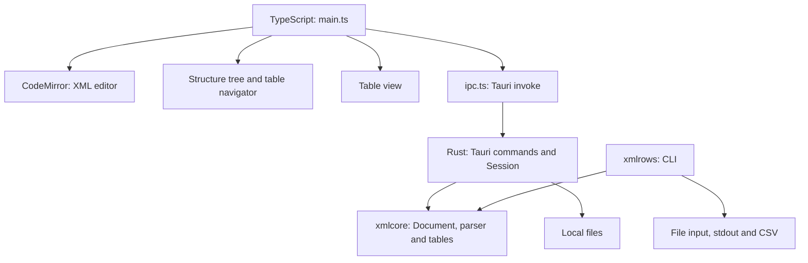

# Technical architecture

This document describes the XMLRows implementation as of September 20,
2026. It covers the desktop application, XML core and `xmlrows` CLI.

## Overview

The application has three layers: a TypeScript user interface, a Rust command
layer in Tauri and the `xmlcore` library. The CLI uses the same library
directly, without starting Tauri or the user interface.

The XML source text underlies every view. The tree and tables are derived
from that text and point back to specific source ranges. Editing cells does
not convert the document into a separate spreadsheet model.



There is no database or separate application server. Document processing and
storage are local. The Vite server is used during development; the release
application loads prebuilt frontend files.

## Technology stack

The versions below are major versions or requirements from the manifests.
Exact dependency versions are pinned by `package-lock.json` and the Cargo
lockfiles.

| Technology | Role |
| --- | --- |
| Rust, edition 2021 | XML model, parsing, table construction, file operations and CLI |
| Tauri 2 | Desktop window, system integration and IPC between JavaScript and Rust |
| TypeScript 5 | Frontend without React, Vue or another component framework |
| HTML and CSS | Layout, components, dialogs and light/dark themes |
| CodeMirror 6 | XML editor, text transactions, search, highlighting and undo history |
| Lezer / CodeMirror XML | Syntax highlighting and editor language support; separate from the Rust parser |
| Vite 5 | Development server and frontend builds |
| Serde and serde_json | Serialization and data types in the Rust command layer |
| tauri-plugin-dialog 2 | Native open and save dialogs |
| Playwright | Browser-based GUI regression tests |
| Python 3 | Test helpers, IPC checks and license notice generation |

`xmlcore` has no external Rust dependencies. The Tauri package declares Rust
1.77 as its minimum; that alone does not verify the minimum requirements of
all subsequent dependency versions.

## Code map

| File or directory | Responsibility |
| --- | --- |
| `src/main.ts` | Startup, application state, synchronization, file actions and pane coordination |
| `src/editor.ts` | CodeMirror setup, editor extensions and source range highlighting |
| `src/tree.ts` | Structure tree, table navigator, navigation and paginated loading |
| `src/table.ts` | Table rendering, selection, sorting, cell editing and row actions |
| `src/ipc.ts` | TypeScript contracts and wrappers around `invoke` |
| `src/clipboard.ts` | TSV and HTML copying, with fallbacks for different webviews |
| `src/styles.css`, `src/icons.ts`, `index.html` | Visual styling, icons and page structure |
| `src-tauri/src/lib.rs` | Tauri commands, session state, file operations and position conversion |
| `src-tauri/src/main.rs` | Desktop application entry point |
| `crates/xmlcore/src/parse.rs` | Custom, error-tolerant XML scanner |
| `crates/xmlcore/src/arena.rs` | Compact storage of nodes, attributes and names |
| `crates/xmlcore/src/pos.rs` | Conversion between byte offsets, UTF-16 and lines |
| `crates/xmlcore/src/table.rs` | Table projection, columns, sorting and export |
| `crates/xmlcore/src/format.rs` | XML reformatting and indentation |
| `crates/xmlcore/examples/xmlrows.rs` | Standalone CLI using the XML core |

## XML model

`Document` consists of the source text (`String`), the `Arena` node index and
the `PosMap` position map.

`Arena` uses parallel vectors, commonly called a *struct of arrays*, rather
than one heap-allocated object per node. Node IDs are `u32` indices. Parent,
first child and next sibling references are stored as these indices.
Element and attribute names are interned: each distinct name is stored once
and referenced by a numeric ID.

Each node records byte ranges for the entire node and its contents.
Attributes have separate ranges for their names and values. This allows a
single value to be edited without serializing the rest of the document again.

The parser recognizes elements, text, CDATA, comments, processing
instructions, doctypes and XML declarations. It attempts to continue after
syntax errors and can handle multiple root nodes, such as XML fragments.
It collects at most 500 diagnostics.

This is a source-oriented scanner, not a fully conforming XML processor or
XSD validator. Entities are preserved as written, and namespace prefixes
are not resolved to namespace URIs.

## Positions and IPC

The Rust core uses UTF-8 byte offsets. JavaScript and CodeMirror use UTF-16
code units. All text positions crossing the IPC boundary are converted to
and from UTF-16 in the Tauri layer using `PosMap`. An emoji can therefore
have different lengths in Rust and the editor without shifting the intended
cell highlight.

`src/ipc.ts` defines the frontend contract; Rust has corresponding DTOs in
`src-tauri/src/lib.rs`. These types are maintained manually rather than
through code generation.

| Commands | Purpose |
| --- | --- |
| `open_file`, `save_file` | Read and write documents |
| `document_info`, `document_text` | Metadata and source text |
| `set_text`, `apply_change` | Replace the document or a single text range |
| `tree_children`, `table_list` | Fetch portions of the tree or table navigator |
| `node_detail`, `node_range`, `locate` | Retrieve details and link text to structure |
| `sort_group`, `export_group` | Compute sort order and export to the clipboard |
| `format_document` | Generate formatted XML text |

The entire tree is not sent to the frontend. Structure and tables are fetched
on demand. The source text itself, however, is loaded in full into CodeMirror.

## State and editing flow

Rust holds one active document in `Mutex<Session>`. The session contains the
document, file path, revision number, dirty flag and a revision-dependent
cache identifying tree branches that contain tables.

The frontend holds the editor text, active selection, table settings and a
queue of pending text changes. While the user types, the editor may briefly
be ahead of the Rust model.

1. An edit is applied as a CodeMirror transaction and added to the undo history.
2. The change is queued. Normal typing triggers synchronization after 180 ms
   without further changes.
3. `flush()` sends the changes sequentially through `apply_change`.
4. Rust converts the positions to byte ranges, replaces the text and reparses
   the entire document for each submitted change.
5. Metadata, tree and table views are refreshed. The active position is used
   to locate the appropriate node after reparsing.

Node IDs are not stable across reparses. Old cell ranges and selections must
therefore not be reused after the text changes. The frontend uses document
versions and request counters to discard stale responses. A synchronization
flag prevents navigation between panes from triggering a feedback loop.

Cell editing uses the same CodeMirror transactions as direct text editing.
The value being edited is read from the complete source range, not from a
potentially shortened cell display. This edits XML source text; it is not a
general schema-driven editing model with automatic escaping.

“Duplicate row” copies the selected row's XML range and inserts it immediately
after the original. Attributes, nested structure, comments and CDATA are
preserved, but identifiers and other values are also copied unchanged. The
operation does not generate new business-unique IDs. It is blocked when
known syntax errors are present.

## How tables are derived

Children of the same parent are grouped by element name. A group of repeated
elements produces one row per element. The GUI displays tables with at least
two rows; the core's group model can also represent single-row groups.

Attributes and text values become columns. Nested structure is flattened
into paths such as `Header/Meta/Ref@code`. Repeated child nodes receive
positional indices such as `Othr[2]/Id`. An index describes XML order, not a
key matching the same business object across rows.

The GUI starts at depth 12, with 2,000 displayed rows and no explicit limit
on column count or expanded repetitions. Depth 12 is the current GUI limit,
not unlimited depth. The core discovers columns from up to 2,000,000 rows
and reports when discovery uses a sample.

The table navigator shows names and actual row counts. Once an outer table
is found, tables within its rows are not listed as separate entries. A
regular structure view is available as an alternative to this navigator.

Selecting a table navigates to its first row without highlighting the entire
XML range. Row and cell selections highlight their respective source ranges.
Moving the editor caret can locate the corresponding table cell without
moving keyboard focus.

Sorting changes display order, not the order in the XML file. Table rows
are virtualized using a fixed row height of 32 px and eight extra rows on
either side of the visible range. This limits DOM size; it does not mean
that the XML document itself is streamed from disk.

## CLI and export

`xmlrows` is implemented as a Cargo example, not a Tauri command. Arguments
are parsed manually to keep `xmlcore` free of external dependencies.

```sh
cargo build --release --manifest-path crates/xmlcore/Cargo.toml --example xmlrows
./crates/xmlcore/target/release/examples/xmlrows --help
./crates/xmlcore/target/release/examples/xmlrows --csv -o result.csv input.xml
```

`--select` / `-s` selects a parent element using a tag path; this is not XPath.
`--group` / `-g` selects the name of the direct children that become rows.
Without an explicit selection, the CLI attempts to find the largest repeated
group. It also supports group listings, sorting and table shape limits.
Diagnostics and warnings are kept separate from CSV output.

The CLI and GUI have different default limits. The CLI's regular display
uses depth 3 and 60 columns, among other defaults. CSV mode removes the
default limits on rows, columns and cell length, but depth and repetition
limits still apply. See `xmlrows --help` for the current options.

The GUI copies tables as TSV (`text/plain`) and, when possible, HTML tables.
Exporting an entire group ignores the display row limit. The HTML version
is omitted above 20,000 rows. The TSV clipboard format flattens tabs and
line breaks in cell values; the HTML format preserves them. This differs
from the CLI's CSV file export.

## Files, platforms and limitations

- File loading uses `String::from_utf8_lossy`. The XML declaration's encoding
  does not control decoding. Invalid UTF-8 sequences may be replaced, and
  saving writes the session's UTF-8 text.
- Saving uses `std::fs::write` directly; atomic saving through a temporary
  file and rename is not implemented.
- Documents larger than 32 MiB receive a read-only editor in the GUI. This
  is a user interface limit, not a general memory cap or security boundary.
- The entire document is held in memory as both editor text and a Rust model.
  Full reparsing and wide tables can therefore be expensive for large files.
- JSON support, incremental parsing and a complete browser/WASM application
  are not implemented. The independent core makes this reuse possible, but
  the integrations must be built separately.
- The current packaging configuration targets macOS `.app` and `.dmg`, with
  a declared minimum of macOS 10.15. Vite targets `safari15`; actual support
  for older macOS versions requires separate testing. Tauri alone does not
  guarantee platform support.

Tauri uses the operating system's webview. Native dialog permissions are
defined in `src-tauri/capabilities/default.json`. File operations are performed
by the application's own Rust commands. The Content Security Policy is in
`tauri.conf.json`. The theme preference is stored locally under the key
`xmlrows-theme`.

## Building and verification

```sh
npm install
npm run tauri -- dev

# TypeScript check and frontend build
npm run build

# Optimized desktop application
npm run tauri -- build --bundles app

# Core, CLI and Tauri layer tests
cargo test --manifest-path crates/xmlcore/Cargo.toml
cargo test --manifest-path src-tauri/Cargo.toml --lib

# GUI regressions; requires an installed Chromium/Chrome browser
npm run test:gui
```

The release profile uses optimization level 3, LTO, one codegen unit,
stripping and `panic = "abort"`. The frontend is built into `dist/` before
Tauri bundling. Signing and notarization are not set up in the current
configuration.

Rust tests cover the model, tables, positions and CLI behavior. GUI tests
run Playwright against Vite and a test bridge derived from the actual Rust
command layer. File operations use temporary files; native dialogs are
replaced with test stubs. This does not test the macOS webview itself or the
installation package. See the [GUI test README](tests/gui/README.md).

`tools/check-ipc.py` provides a separate type check of the command layer
without a full Tauri build; it does not replace runtime tests of the IPC
contract.

## Licensing and distribution

The application and `xmlcore` use the MIT license. Credit goes to Martin
Valland, with copyright held by Bråtet Software AS. Third-party dependencies
retain their own licenses.

`tools/license-notices.py` generates dependency notices for the build host.
The license and notices appear in About and are bundled under
`Contents/Resources/legal` in the macOS application. Notices must be
regenerated after dependency changes. See the
[licensing overview](legal/LICENSING.md).
