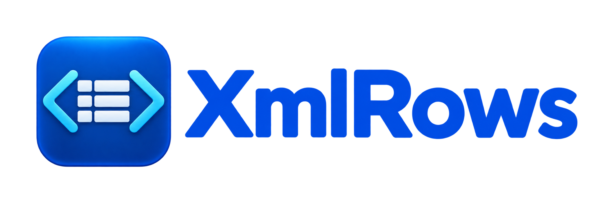
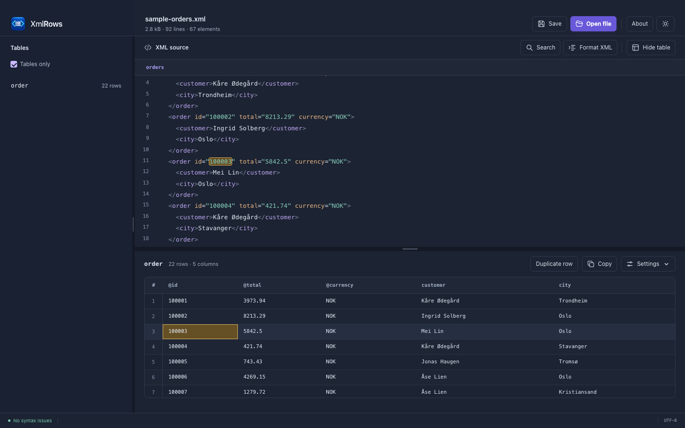

<p align="center">
  
</p>

<h1 align="center">Your XML. A clearer view.</h1>

<p align="center">
  Explore XML as tables. Edit values in place. Stay connected to the source.
</p>

<p align="center">
  <a href="#get-started">Get started</a> ·
  <a href="docs/CLI.md">CLI guide</a> ·
  <a href="ARCHITECTURE.md">Architecture</a> ·
  <a href="LICENSE.txt">MIT license</a>
</p>

<p align="center"><strong>macOS desktop app · Rust CLI · Free and open source</strong></p>

<picture>
  <source media="(prefers-color-scheme: dark)" srcset="docs/images/xmlrows-dark.png" />
  <source media="(prefers-color-scheme: light)" srcset="docs/images/xmlrows-light.png" />
  
</picture>

*The XMLRows interface with sample order data. The screenshot follows your GitHub theme.*

## Find the data inside the markup

XML is good at describing structure. Reading hundreds of repeated records by
hand is another matter. XMLRows turns repeated elements into tables so you can
compare values, spot differences and work with the data while keeping the
original XML close at hand.

- **Discover tables automatically.** Jump straight to repeated records, with
  table names and row counts in the sidebar.
- **Move between data and source.** Select a cell to highlight its XML, or place
  the editor cursor in a value to find the corresponding table cell.
- **Edit without rebuilding the document.** Change a cell's source value in
  place, with the same undo history as the text editor.
- **See through nested structures.** Attributes and nested values become named
  columns; repeated children can expand into separate columns.
- **Sort, copy and export.** Sort the view without rearranging the XML. Copy
  tables into a spreadsheet, or export CSV from the command line.
- **Duplicate a row with its structure intact.** Copy a record, including its
  attributes and nested elements, then edit the new values.

Your files stay on your machine. Document processing is local, with no account
or cloud service required. The desktop app includes light and dark themes.

## From XML to a spreadsheet

Open a file, choose a table and click **Copy** to paste it into Excel, Numbers
or another spreadsheet. Copying a whole table includes rows beyond the current
display limit.

For scripts and repeatable exports, use the same Rust engine through the CLI:

```sh
xmlrows --csv -o orders.csv orders.xml
xmlrows --csv --sort @total --desc -o sorted-orders.csv orders.xml
```

Nested documents can be narrowed to a parent path and a specific row element:

```sh
xmlrows --select /shop/orders --group order --csv shop.xml
```

See the [CLI guide](docs/CLI.md) for installation, selection rules, limits,
sorting and export options. `xmlrows` in these examples refers to the CLI
binary built below.

## Get started

### Desktop app

The current desktop build targets macOS. An Apple Silicon `.dmg` can be built
locally; release binaries are not currently attached to this repository.

To build from source, install Node.js/npm, Rust/Cargo and the macOS build tools
(Xcode Command Line Tools), then run these commands from the repository root:

```sh
npm install
npm run tauri -- dev
```

Build an installable application and disk image:

```sh
npm run tauri -- build --bundles app,dmg
```

Build output is written under `src-tauri/target/release/bundle/`. Open the DMG
and drag **XMLRows** to **Applications**. Current builds are not Developer ID
signed or notarized, so macOS may require explicit approval to open them.
The app icons are already included in the repository.

### Command-line tool

The CLI needs Rust/Cargo and does not require Node.js or Tauri:

```sh
cargo build --release --manifest-path crates/xmlcore/Cargo.toml --example xmlrows
./crates/xmlcore/target/release/examples/xmlrows --help
```

Copy the executable into a directory on your `PATH`, or invoke it using its
full path. The desktop executable and CLI are separate builds.

## A few useful shortcuts

| Shortcut | Action |
| --- | --- |
| `⌘O` / `⌘S` | Open / save a file |
| `⌘F` | Find text in the XML editor |
| `⇧⌘I` | Reindent the document |
| `⌘J` | Show or hide the table pane |
| `⌘L` | Find the current element in the tree, in structure mode |
| `⌘C` | Copy the selection or table when the table pane has focus |

Double-click a populated cell to edit its source value. Drag the dividers to
resize the panes. Table settings control depth, displayed rows and columns.

## Current scope

XMLRows is an early desktop application. A few boundaries matter:

- **XML only today.** JSON support is not implemented.
- **Source editing, not schema validation.** The parser reports many syntax
  problems and tolerates incomplete documents; it is not a complete XML or
  XSD validator. Entities and namespace prefixes remain as written.
- **UTF-8 input.** Other encodings are not decoded using the XML declaration;
  invalid UTF-8 bytes may be replaced when loading.
- **Large files have trade-offs.** The whole document lives in memory and is
  reparsed after changes. The GUI makes documents above 32 MiB read-only.
- **Display limits are configurable.** The GUI starts at depth 12 and 2,000
  rows, with all discovered columns enabled. CLI defaults differ.
- **Duplicated rows keep their values.** Update IDs yourself where uniqueness
  is required by the document's format.

The [architecture document](ARCHITECTURE.md) explains the data model,
performance choices and remaining limitations in detail.

## Built with

**Tauri 2 · Rust · TypeScript · CodeMirror 6 · Vite**

The dependency-free `xmlcore` library powers both the desktop app and the CLI.
The frontend uses plain TypeScript, HTML and CSS. Tables retain links to source
ranges so editing a value does not require reserializing the whole document.

```text
crates/xmlcore/   XML parser, document model, table projection and CLI
src-tauri/       Desktop shell, file operations and IPC
src/             Source editor, tree, tables and application UI
tests/gui/       GUI regression suite
```

## Development and tests

```sh
npm run build
cargo test --manifest-path crates/xmlcore/Cargo.toml
cargo test --manifest-path src-tauri/Cargo.toml --lib

# Install the test browser once, then run GUI regressions
npx playwright install chromium
npm run test:gui
```

GUI tests exercise the actual frontend and Rust command layer through a test
bridge, with native dialogs stubbed. The README screenshots use the same
frontend and bridge with the repository's sample XML; they are not design
mockups. See the [GUI testing guide](tests/gui/README.md).

Bug reports and focused contributions are welcome. When reporting a parsing
or table issue, include a small, anonymized XML example and the expected result.

## License and credits

Created by **Martin Valland**. Copyright © 2026 **Bråtet Software AS**.

XMLRows and `xmlcore` are released under the [MIT License](LICENSE.txt).
You may use, modify and redistribute them, including commercially, while
retaining the required copyright and license notices.

Third-party components retain their own licenses. Notices are available in
**About** and bundled with the application. After dependency updates, regenerate
them with `python3 tools/license-notices.py`. See the
[licensing overview](legal/LICENSING.md).
